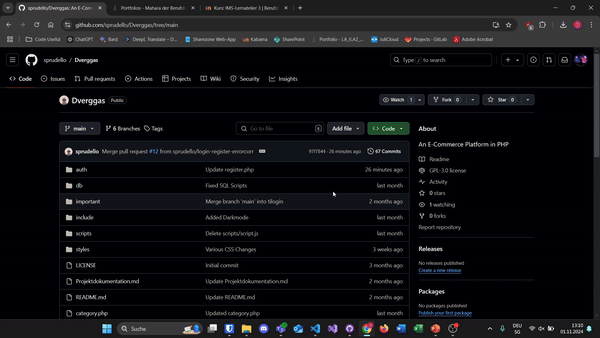

# Dverggas
An E-Commerce Website in PHP.

### Team : ILA3-0120

- Timo Goedertier
- Alberto Manser
- Agachan Atputharsa
- Cyril Lutziger

### Team : ILA3-0110

- Julius V. Burlet
- Timo Goedertier

### Instructions

- Clone this repository with:

```
git clone https://github.com/sprudello/Dverggas.git
```

- Or download the ZIP by pressing on <>Code and then Download ZIP.
    - If you download the ZIP you have to be careful not to copy the folder with the Dverggas folder inside, but the folder with all the files.


  
- Then Download XAMPP [here](https://www.apachefriends.org/download.html).

- After downloading and installing XAMPP, launch XAMPP. You should then be able to see the Control panel.


- Start Apache and the MySQL in the control panel. (The MySQL Module may crash so you just have to start it again.)


- In the Control Panel press on Explorer to open the xampp folder.

- From the xampp folder, locate and navigate to the htdocs folder.


- In the htdocs folder, paste the Dverggas folder into it. (Path to the Dverggas folder should then look like this: ..\xampp\htdocs\Dverggas)


- Press on Admin, on the same row as MySQL, in the control panel. A website should open up.


- Locate and press on the SQL Button.


- In this you can copypaste the MySQL Scripts located in the db folder. (You have to do it in the order below.)

    - Firstly, take the script from [tables.sql](https://github.com/sprudello/Dverggas/blob/main/db/tables.sql).

- For the second 2 files you first have to go into the Dverggas Database and then again go into the SQL section. You should see a ``Run SQL query/queries on database Dverggas``

    - Secondly, take the script from [categories.sql](https://github.com/sprudello/Dverggas/blob/main/db/categories.sql)
    - Thirdly, take the script from [products.sql](https://github.com/sprudello/Dverggas/blob/main/db/products.sql)
    - You can ignore connection.php


- If all the scripts were successfully executed, then you can move to [localhost/dverggas](http://localhost/dverggas/) and test out the website.


### Tutorial Video

[VID](imgs/FullTutorial.mp4)
